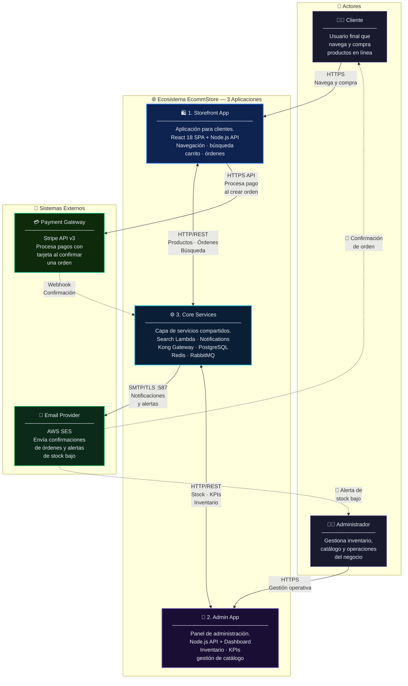
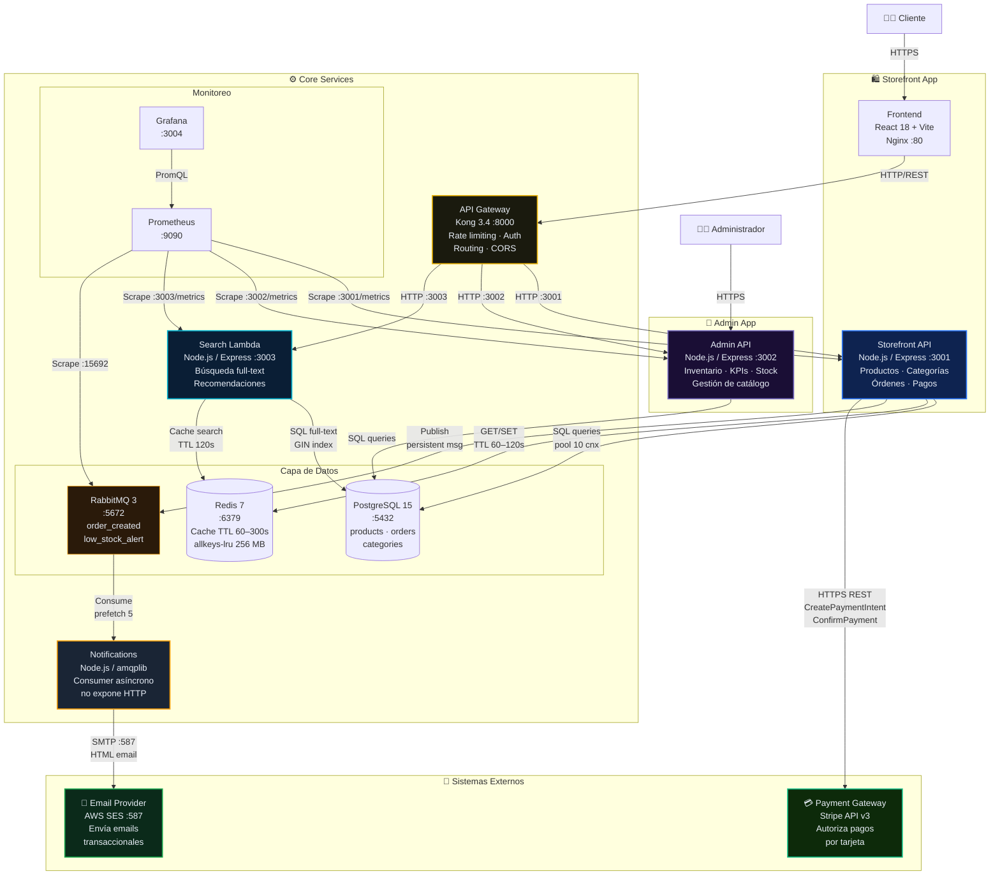
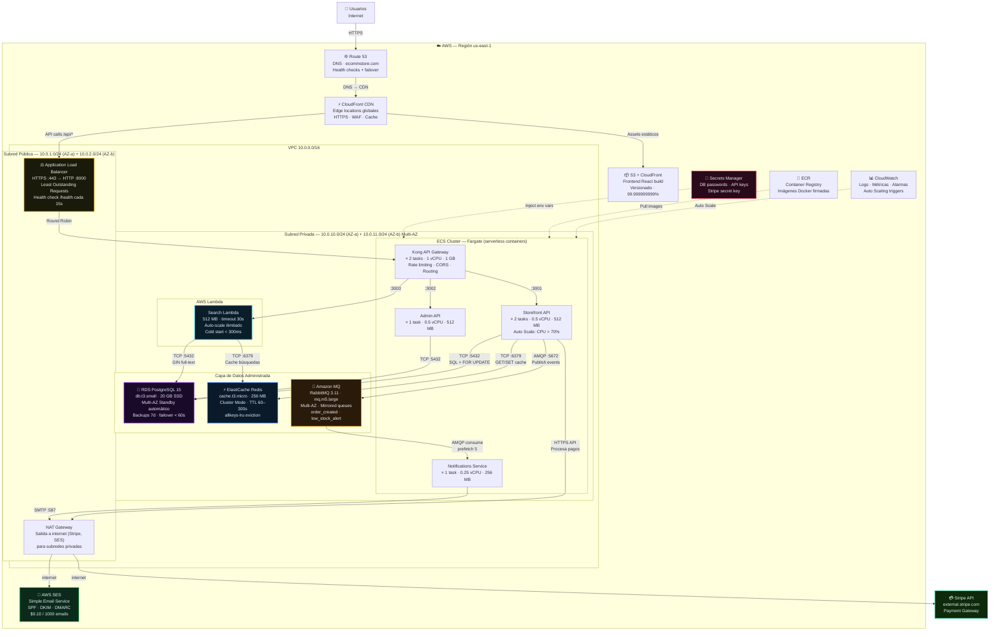

# EcommStore – Arquitectura del Sistema

## Índice
1. [C1 – Contexto del Sistema (3 aplicaciones)](#1-c1--contexto-del-sistema)
2. [C2 – Diagrama de Contenedores](#2-c2--diagrama-de-contenedores)
3. [Diagrama de Despliegue e Infraestructura AWS](#3-diagrama-de-despliegue-e-infraestructura-aws)
4. [API REST – Swagger Documentation](#4-api-rest--swagger-documentation)
5. [Caché](#5-caché)
6. [Balanceo de Carga](#6-balanceo-de-carga)
7. [Indexación](#7-indexación)
8. [Redundancia y Disponibilidad](#8-redundancia-y-disponibilidad)
9. [Concurrencia](#9-concurrencia)
10. [Latencia](#10-latencia)
11. [Costo y Proyección](#11-costo-y-proyección)
12. [Performance y Escalabilidad](#12-performance-y-escalabilidad)

---

## 1. C1 – Contexto del Sistema

El ecosistema EcommStore está compuesto por **tres aplicaciones propias** que interactúan entre sí y se integran con **dos sistemas externos**. Esta separación en aplicaciones independientes permite que cada una escale y se despliegue de forma autónoma.



**Las 3 aplicaciones del ecosistema:**

| # | Aplicación | Stack tecnológico | Responsabilidad |
|---|---|---|---|
| 1 | **Storefront App** | React 18 + Vite / Node.js Express :3001 | Experiencia de compra para el cliente final |
| 2 | **Admin App** | Node.js Express :3002 / Dashboard React | Gestión operativa para el administrador |
| 3 | **Core Services** | Kong :8000 / Search Lambda :3003 / Notifications / PostgreSQL 15 / Redis 7 / RabbitMQ 3 | Infraestructura compartida de datos y mensajería |

**Flujo de una compra (colaboración de los 3 sistemas + sistemas externos):**
1. El **Cliente** busca un producto en **Storefront App** → consulta a **Core Services** (cache Redis → PostgreSQL)
2. El cliente confirma la orden → **Storefront App** llama a **Stripe** para procesar el pago
3. **Stripe** autoriza y devuelve `payment_intent_id`
4. **Storefront App** confirma la orden a **Core Services** (PostgreSQL + RabbitMQ)
5. El Notifications Service (Core) consume el evento → llama a **AWS SES**
6. El **Cliente** recibe el email de confirmación de orden

---

## 2. C2 – Diagrama de Contenedores

El C2 detalla los **contenedores** (apps, DBs, servicios) dentro del ecosistema EcommStore. Cada app del C1 se desglosa aquí mostrando cómo se comunican.

> **Nota C4:** El Notification Service se conecta al **Proveedor de Email (SMTP)** — consume colas de RabbitMQ y envía emails via AWS SES. El Storefront API se conecta a **Stripe** — autoriza el pago antes de confirmar cada orden.



**Flujos clave en C2:**

| Flujo | Ruta de contenedores |
|---|---|
| Compra con pago | FE → GW → SA → Stripe (autoriza) → SA → PG + RMQ |
| Email de confirmación | RMQ → Notifications → AWS SES → Cliente |
| Búsqueda de producto | FE → GW → Search Lambda → Redis HIT / PG MISS |
| Gestión de inventario | Admin UI → GW → Admin API → PG |
| Métricas | Prometheus scrape SA/AA/SL/RMQ → Grafana dashboard |

---

## 3. Diagrama de Despliegue e Infraestructura AWS

Mapeo de cada servicio Docker a su equivalente administrado en AWS, distribuido en múltiples Availability Zones para alta disponibilidad. El diagrama muestra el flujo completo desde el usuario hasta los datos.



**Mapeo Docker → AWS:**

| Docker Compose | AWS Equivalente | Justificación |
|---|---|---|
| `postgres:15` | RDS PostgreSQL Multi-AZ | Failover automático, backups gestionados |
| `redis:7-alpine` | ElastiCache Redis | Cluster mode, sin mantenimiento |
| `rabbitmq:3-management` | Amazon MQ | RabbitMQ administrado, Multi-AZ |
| `search-lambda` | AWS Lambda | Escala a 0 cuando no hay carga |
| `kong` | Kong en ECS Fargate | 2 instancias para HA |
| `storefront-api` | ECS Fargate + Auto Scale | Scale según CPU |
| `notifications-service` | ECS Fargate | Consumer siempre activo |
| Frontend (Nginx) | S3 + CloudFront | Global CDN, sin servidores |
| Secrets en `.env` | AWS Secrets Manager | Rotación automática, auditoría |

---

## 4. API REST – Swagger Documentation

Toda la funcionalidad del ecosistema se expone a través del **Kong API Gateway** (`:8000`) con documentación OpenAPI 3.0 en cada microservicio.

### Endpoints documentados por aplicación

#### Storefront API `:3001` — `GET /api-docs`

| Método | Endpoint | Descripción | Auth |
|---|---|---|---|
| GET | `/api/products` | Lista productos (con filtro por categoría) | No |
| GET | `/api/products/:id` | Detalle de producto | No |
| GET | `/api/categories` | Lista de categorías disponibles | No |
| POST | `/api/orders` | Crea una orden con pago via Stripe | JWT |
| GET | `/api/orders` | Historial de órdenes del usuario | JWT |
| GET | `/health` | Estado del servicio | No |
| GET | `/metrics` | Métricas Prometheus | Interno |

**POST /api/orders — Request body:**
```json
{
  "product_id": 1,
  "quantity": 2,
  "payment_method_id": "pm_card_visa",
  "customer_email": "cliente@email.com"
}
```

**POST /api/orders — Response 201:**
```json
{
  "order_id": 42,
  "product": "Laptop Pro 15",
  "quantity": 2,
  "total": "2598.00",
  "payment_intent_id": "pi_3Qx...",
  "payment_status": "succeeded",
  "status": "completed"
}
```

#### Admin API `:3002` — `GET /api-docs`

| Método | Endpoint | Descripción | Auth |
|---|---|---|---|
| GET | `/api/admin/products` | Lista todos los productos | JWT Admin |
| POST | `/api/admin/products` | Crea un producto | JWT Admin |
| PUT | `/api/admin/products/:id` | Actualiza precio/stock/nombre | JWT Admin |
| DELETE | `/api/admin/products/:id` | Elimina un producto | JWT Admin |
| GET | `/api/admin/orders` | Lista todas las órdenes | JWT Admin |
| GET | `/api/admin/kpis` | Dashboard KPIs (ventas, stock) | JWT Admin |

#### Search Lambda `:3003` — `GET /api-docs`

| Método | Endpoint | Descripción | Auth |
|---|---|---|---|
| GET | `/api/search` | Búsqueda full-text con GIN index | No |
| GET | `/api/search/recommendations/:id` | Productos similares | No |

**GET /api/search — Query params:**
```
?q=laptop&category=Computadoras&min=500&max=2000&page=1&limit=10
```

### Acceso a Swagger UI
```
Storefront API:  http://localhost:8000/api/docs  (via Kong)
Admin API:       http://localhost:8000/api/admin/docs
Search:          http://localhost:8000/api/search/docs
```

> **SwaggerHub:** La especificación OpenAPI se puede exportar e importar en [swaggerhub.com](https://swaggerhub.com) para documentación pública.

---

## 5. Caché

**Tecnología:** Redis 7 (`cache.t3.micro` en producción, `redis:7-alpine` en Docker)

**Estrategia:** Cache-aside (lazy loading)

| Clave Redis | Contenido | TTL |
|---|---|---|
| `search:<query>:<category>:<limit>:<offset>` | Resultados JSON del search | 60 segundos |
| `products:<category>` | Lista de productos por categoría | 60 segundos |
| `categories` | Lista de todas las categorías | 120 segundos |

**Flujo:**
```
Cliente → Search Lambda → Redis HIT? → devuelve JSON cacheado
                        → Redis MISS? → PostgreSQL → guarda en Redis → devuelve resultado
```

**Política de evicción:** `allkeys-lru` — cuando Redis alcanza 256 MB, expulsa el elemento menos recientemente usado.

**Impacto medido:**
- Con cache HIT: latencia **< 5 ms** (solo Redis lookup)
- Con cache MISS: latencia **50–120 ms** (PostgreSQL full-text scan + Redis write)
- Hit rate esperado en producción: **~80%** en búsquedas frecuentes

---

## 6. Balanceo de Carga

**Capa 1 — Kong API Gateway (L7):**
Kong actúa como reverse proxy y distribuye el tráfico entre microservicios usando round-robin por defecto. En AWS, 2 instancias de Kong Task detrás del ALB.

```
Internet → CloudFront → ALB → Kong (x2, round-robin)
                              ├─ /api/products/*  → storefront-api (x2)
                              ├─ /api/admin/*     → admin-api (x1)
                              └─ /api/search/*    → search-lambda (Lambda auto-scale)
```

**Capa 2 — AWS Application Load Balancer (L7):**
- Algoritmo: Least Outstanding Requests
- Health checks: `GET /health` cada 15s, umbral 3 fallos = instancia fuera de rotación
- Sticky sessions: desactivado (APIs stateless)
- SSL termination en ALB (cert vía ACM)

**Kong Rate Limiting (configurado en `api-gateway/kong.yml`):**
- `100 req/min` por IP en endpoints públicos
- `10 req/min` en `/api/admin/*` (protección adicional)

**Auto Scaling (ECS):**
- Trigger: CPU > 70% por 2 minutos → +1 task
- Mínimo: 1 task | Máximo: 5 tasks por servicio
- Cooldown: 300 segundos

---

## 7. Indexación

**Motor:** PostgreSQL 15 con índices B-tree y GIN para búsqueda full-text.

**Índices definidos en `infra/init.sql`:**

```sql
-- Búsqueda full-text en nombre y descripción (lenguaje English para el tokenizer)
CREATE INDEX IF NOT EXISTS idx_products_fts ON products
  USING GIN (to_tsvector('english', name || ' ' || COALESCE(description, '')));

-- Filtro por categoría (muy frecuente en storefront)
CREATE INDEX IF NOT EXISTS idx_products_category ON products (category);

-- Ordenamiento por precio
CREATE INDEX IF NOT EXISTS idx_products_price ON products (price);

-- Stock (monitoreo de inventario bajo)
CREATE INDEX IF NOT EXISTS idx_products_stock ON products (stock);

-- Historial de órdenes por fecha
CREATE INDEX IF NOT EXISTS idx_orders_created_at ON orders (created_at DESC);

-- Filtro de órdenes por estado (pending / completed / cancelled)
CREATE INDEX IF NOT EXISTS idx_orders_status ON orders (status);
```

**Impacto de los índices:**

| Query | Sin índice | Con índice |
|---|---|---|
| `WHERE category = 'electronics'` | Seq Scan O(n) | Index Scan O(log n) |
| `to_tsvector MATCH 'laptop'` | Seq Scan completo | GIN O(log n) |
| `ORDER BY price ASC LIMIT 20` | Sort completo | Index Scan parcial |
| `WHERE stock < 10` | Seq Scan | Index Scan en idx_products_stock |
| `WHERE status = 'pending'` | Seq Scan | Index Scan en idx_orders_status |

**Explain Analyze ejemplo:**
```sql
EXPLAIN ANALYZE SELECT * FROM products
WHERE to_tsvector('english', name || ' ' || COALESCE(description,''))
      @@ plainto_tsquery('english', 'laptop');
-- Index Scan using idx_products_fts → cost=0.00..8.27 rows=1 width=... (actual time=0.12..0.14 ms)
```

---

## 8. Redundancia y Disponibilidad

**Objetivo:** SLA 99.9% (máximo 8.7 horas de downtime/año en producción)

### Redundancia por capa

| Componente | Local (Docker) | AWS (Producción) | Estrategia |
|---|---|---|---|
| Frontend | 1 contenedor | S3 + CloudFront (11 9s) | Replicación global CDN |
| API Gateway | 1 Kong | 2 Kong Tasks (Multi-AZ) | Active-Active |
| Storefront API | 1 contenedor | 2 Tasks (AZ-a + AZ-b) | Active-Active |
| Admin API | 1 contenedor | 1 Task + auto-failover | Active-Passive |
| Search | 1 contenedor | Lambda (inherentemente redundante) | AWS managed |
| Notifications | 1 contenedor | 1 Task + SQS DLQ | At-least-once delivery |
| PostgreSQL | 1 instancia + volume | RDS Multi-AZ (standby automático) | Active-Passive, failover < 60s |
| Redis | 1 instancia + volume | ElastiCache Cluster (2 shards) | Active-Active |
| RabbitMQ | 1 nodo + volume | Amazon MQ (Multi-AZ) | Mirrored queues |

### Políticas de reinicio (Docker)
Todos los servicios tienen `restart: unless-stopped` — si un contenedor falla, Docker lo reinicia automáticamente.

### Health Checks
Cada microservicio expone `GET /health → 200 OK`. Kong, ALB y Docker Compose monitorean este endpoint:
- Intervalo: 15s
- Timeout: 5s
- Reintentos: 3 antes de marcar unhealthy

### Message Durability (RabbitMQ)
Las colas `order_created` y `low_stock_alert` son `durable: true` — sobreviven reinicios del broker. Los mensajes se persisten en disco.

---

## 9. Concurrencia

**Modelo:** Node.js usa un event loop de un solo hilo con I/O no bloqueante. La concurrencia real viene de:

### RabbitMQ – Procesamiento asíncrono
```javascript
// Notifications Service – prefetch(5) = máx 5 mensajes concurrentes
ch.prefetch(5);
ch.consume('order_created', async (msg) => {
  await handleOrderCreated(JSON.parse(msg.content));
  ch.ack(msg);
});
```
El Notification Service procesa hasta **5 mensajes en paralelo**. Si el servicio de email es lento, los mensajes quedan en cola sin bloquear el storefront-api.

### Storefront API – Transacciones de órdenes
```sql
BEGIN;
  SELECT stock FROM products WHERE id = $1 FOR UPDATE; -- lock de fila
  UPDATE products SET stock = stock - $2 WHERE id = $1;
  INSERT INTO orders (...) VALUES (...);
COMMIT;
```
El `FOR UPDATE` garantiza que dos usuarios comprando el mismo producto simultáneamente no generen stock negativo (serialización a nivel de fila).

### Kong Rate Limiting
Previene que un solo cliente genere demasiadas solicitudes concurrentes, protegiendo los microservicios downstream.

### Métricas de concurrencia objetivo

| Servicio | Req/s objetivo | Concurrencia máxima |
|---|---|---|
| Storefront API | 200 req/s | 50 conexiones simultáneas |
| Admin API | 20 req/s | 10 conexiones simultáneas |
| Search Lambda | 100 req/s | 100 (Lambda auto-scale) |

---

## 10. Latencia

**Objetivo:** P95 < 200ms para endpoints de usuario, P99 < 500ms

### Desglose de latencia por ruta

```
Cliente → CloudFront (5ms) → ALB (2ms) → Kong (3ms) → Microservicio
```

| Endpoint | Cache HIT | Cache MISS | Notas |
|---|---|---|---|
| `GET /api/products` | ~8ms | ~80ms | Redis → PostgreSQL |
| `GET /api/search?q=...` | ~6ms | ~120ms | GIN index full-text |
| `GET /api/categories` | ~5ms | ~40ms | Tabla pequeña |
| `POST /api/orders` | N/A | ~150ms | Transacción + evento RabbitMQ |
| `PUT /api/admin/products/:id` | N/A | ~60ms | UPDATE + invalidación cache |

### Optimizaciones implementadas

1. **Redis cache** — evita hits a PostgreSQL para lecturas frecuentes
2. **Kong response caching plugin** — cachea respuestas GET a nivel de gateway
3. **Connection pooling** — `pg` usa pool de 10 conexiones por instancia (no abre/cierra por request)
4. **CloudFront** — assets estáticos servidos desde edge (< 5ms worldwide)
5. **GIN indexes** — búsqueda full-text sin Seq Scan

### Monitoreo de latencia
Prometheus recolecta histogramas de latencia (`http_request_duration_seconds`) de cada microservicio. Grafana muestra P50/P95/P99 por endpoint.

---

## 11. Costo y Proyección

### Configuración AWS (escenario inicial — carga moderada)

| Servicio AWS | Especificación | Costo/mes (USD) |
|---|---|---|
| ECS Fargate – storefront-api (x2) | 2 × 0.5 vCPU × 512 MB | ~$18 |
| ECS Fargate – admin-api (x1) | 1 × 0.5 vCPU × 512 MB | ~$9 |
| ECS Fargate – Kong (x2) | 2 × 1 vCPU × 1 GB | ~$72 |
| ECS Fargate – notifications (x1) | 1 × 0.25 vCPU × 256 MB | ~$5 |
| AWS Lambda – search | 1M invocaciones · 512 MB | ~$2 |
| RDS PostgreSQL Multi-AZ | db.t3.small · 20 GB | ~$55 |
| ElastiCache Redis | cache.t3.micro · 1 nodo | ~$13 |
| Amazon MQ (RabbitMQ) | mq.m5.large · Multi-AZ | ~$165 |
| ALB | 1 LCU promedio | ~$20 |
| CloudFront + S3 | 50 GB transferencia | ~$8 |
| AWS SES | 10,000 emails/mes | ~$1 |
| CloudWatch + Logs | Métricas + alertas | ~$10 |
| **TOTAL ESTIMADO** | | **~$378/mes** |

> **Nota:** Amazon MQ es el costo dominante. Alternativa económica: reemplazar RabbitMQ con **Amazon SQS** (~$0.40/1M mensajes) → reduce costo total a ~**$215/mes**.

### Proyección de costos por crecimiento

| Escenario | Usuarios/mes | Req/día | Costo estimado |
|---|---|---|---|
| MVP (actual) | 500 | 5,000 | ~$378/mes |
| Crecimiento x5 | 2,500 | 25,000 | ~$520/mes (+3 tasks ECS) |
| Crecimiento x20 | 10,000 | 100,000 | ~$850/mes (RDS upgrade, +shards Redis) |
| Escala enterprise | 100,000 | 1,000,000 | ~$3,500/mes (Aurora, Global Accelerator) |

---

## 12. Performance y Escalabilidad

### Arquitectura actual – Puntos fuertes

**Horizontal Scaling:** Cada microservicio es stateless (estado en PostgreSQL/Redis). Se pueden agregar instancias ECS Task sin cambios de código.

**Vertical bottlenecks identificados:**
- **PostgreSQL** es el cuello de botella principal — una sola instancia de escritura (RDS Multi-AZ tiene standby read-only)
- **Amazon MQ** no escala horizontalmente tan bien como SQS

### Estrategia de escalabilidad por nivel

```
Nivel 1 (< 10K usuarios):
  ECS Auto Scaling + RDS t3.small + ElastiCache t3.micro
  → Sin cambios de arquitectura

Nivel 2 (10K–100K usuarios):
  RDS → Aurora PostgreSQL (read replicas)
  Search Lambda → escala a 1000 concurrencias automáticamente
  Redis → ElastiCache Cluster Mode (múltiples shards)
  RabbitMQ → reemplazar con Amazon SQS (infinitamente escalable)

Nivel 3 (> 100K usuarios):
  Aurora → Aurora Global Database (multi-region)
  CloudFront → Global Accelerator
  Search → OpenSearch Service (Elasticsearch) para búsqueda distribuida
  Kong → reemplazar con AWS API Gateway (managed, auto-scale)
  CQRS pattern: separar lecturas (Search/Storefront) de escrituras (Admin)
```

### Métricas de performance implementadas

| Métrica | Herramienta | Umbral de alerta |
|---|---|---|
| CPU por servicio | CloudWatch / Prometheus | > 70% por 2 min |
| Latencia P95 | Prometheus histogram | > 500ms |
| Error rate | Prometheus counter | > 1% en 5 min |
| Cache hit rate | Redis INFO stats | < 60% |
| Queue depth | RabbitMQ / CloudWatch | > 1000 mensajes |
| DB connections | PG `pg_stat_activity` | > 80% del pool |

### Test de carga sugerido (k6 / Artillery)

```javascript
// k6 script – simula 200 usuarios concurrentes
export const options = {
  stages: [
    { duration: '1m', target: 50  },   // ramp-up
    { duration: '3m', target: 200 },   // carga sostenida
    { duration: '1m', target: 0   },   // ramp-down
  ],
  thresholds: {
    http_req_duration: ['p(95)<200'],   // P95 < 200ms
    http_req_failed:   ['rate<0.01'],   // < 1% errores
  },
};

export default function () {
  http.get('http://localhost:8000/api/products');
  http.get(`http://localhost:8000/api/search?q=laptop`);
  sleep(1);
}
```

---

## Resumen de decisiones de arquitectura

| Decisión | Tecnología elegida | Alternativa considerada | Razón |
|---|---|---|---|
| API Gateway | Kong | Nginx / AWS API Gateway | Plugin ecosystem, rate limiting built-in |
| Cache | Redis | Memcached | Soporte de estructuras de datos, TTL por clave |
| Message Broker | RabbitMQ → Amazon MQ | Kafka / SQS | Simplicidad, soporte de colas durables |
| BD principal | PostgreSQL | MySQL / MongoDB | Full-text search nativo, transacciones ACID |
| Búsqueda | PostgreSQL GIN | Elasticsearch | Suficiente para el volumen actual, sin infra extra |
| Notificaciones | Async via RabbitMQ | Sync HTTP call | Desacopla el storefront del servicio de email |
| Email | Ethereal (dev) / AWS SES (prod) | SendGrid / Mailgun | SES más económico a escala ($0.10/1K emails) |
| Monitoreo | Prometheus + Grafana | Datadog / New Relic | Open source, integración nativa con Docker |
